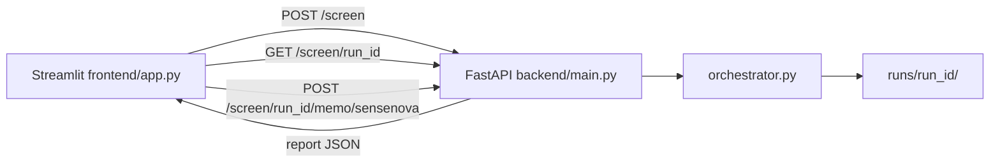

# Frontend ↔ Backend integration

This document describes how the Streamlit UI (`frontend/`) connects to the screening API (`backend/`).

## Architecture



## Running both services

Terminal 1 — backend:

```bash
cd backend
pip install -r requirements.txt
playwright install chromium
python -m uvicorn main:app --reload --port 8000
```

Terminal 2 — frontend:

```bash
cd frontend
pip install -r requirements.txt
streamlit run app.py --server.port 8501
```

Windows PowerShell:

```powershell
cd frontend
pip install -r requirements.txt
streamlit run app.py --server.port 8501
```

Verify:

- Backend: `GET http://localhost:8000/health`
- UI: http://localhost:8501 — sidebar shows backend URL (not "mock data")

## API contract

### Start screening

```http
POST /screen
Content-Type: application/json

{
  "subject_type": "organization",
  "primary_name": "Singapore Airlines",
  "country": "Singapore"
}
```

Response: `{ "run_id": "RSR-...", "status": "queued" }`

### Poll status

```http
GET /screen/{run_id}
```

| `status` | UI behavior |
|----------|-------------|
| `queued` / `running` | Continue polling |
| `complete` | Use `report` object |
| `clarification_required` | Show warning; optional `clarification_form` |
| `error` | Show `error` message |

### Clarification (entity resolution pause)

```http
POST /screen/{run_id}/clarify
Content-Type: application/json

{
  "country": "Singapore",
  "industry": "logistics",
  "candidate_id": "cand_01"
}
```

### Full memo generation

```http
POST /screen/{run_id}/memo/sensenova
```

Behavior:

- Backend attempts SenseNova memo generation first.
- If SenseNova fails (for example `401 Forbidden`), backend automatically falls back to Kimi.
- Response includes memo body and source (`sensenova` or `kimi`).

## Report shape

The backend returns a **v1 reputational screening report** (see [`schemas/reputation-screening-report-rubric.schema.v1.json`](schemas/reputation-screening-report-rubric.schema.v1.json)).

The UI does not consume that schema directly. `frontend/report_adapter.py` maps it to a view model with:

- `riskSummary`, `entityMatch`, `memo` (dashboard metrics)
- `evidenceTable` (tabs)
- `assessment`, `auditTrail`, `keyFindings`

Any client can either adopt the v1 schema or reuse `report_adapter.py`.

## Mock mode

For demos without API credits:

```bash
# backend/.env
USE_MOCK_DATA=true
```

Loads `frontend/mock_data/mock_data.json` (v1-shaped sample).

Backend demo runs (no live APIs):

```bash
cd backend && python scripts/seed_demo.py
# Poll GET /screen/DEMO-ORION-001 or DEMO-AMBIG-001
```

## CORS

The UI uses Python `urllib` from the Streamlit server process to call the API (server-side), not browser fetch — **CORS is not required** for the default setup.

If you embed a browser SPA later, enable CORS on `backend/main.py` (already allows `*`).

## Ports

| Service | Default port |
|---------|----------------|
| FastAPI backend | 8000 |
| Streamlit UI | 8501 |

## Related docs

- [backend/README.md](../backend/README.md) — pipeline, env, logging
- [frontend/README.md](../frontend/README.md) — UI modules
- [architecture.md](architecture.md) — stage design
- [README.md](README.md) — documentation index
